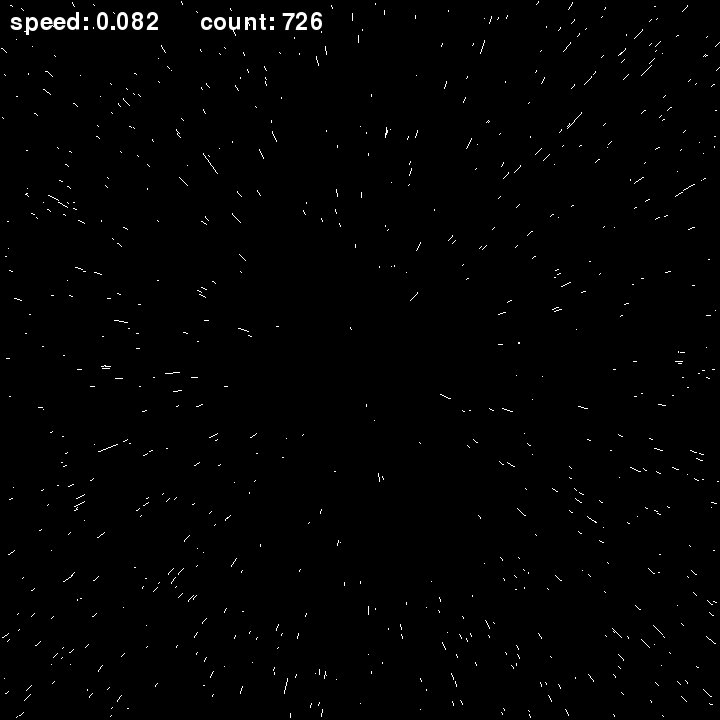
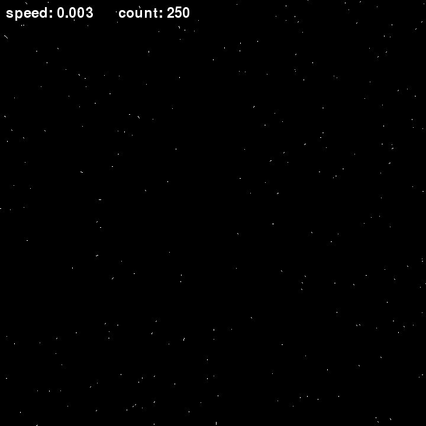
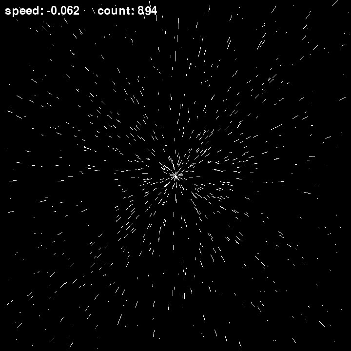

# Starfield

### star field imitation

install pygame and run code

-pip3 install pygame

---

---

---

## Control:
    ESC             Exit program
    F1              Take screen shot jpeg
    
    Arrows:
    LEFT RIGHT      Change count stars
    UP DOWN         Change stars speed
    
    